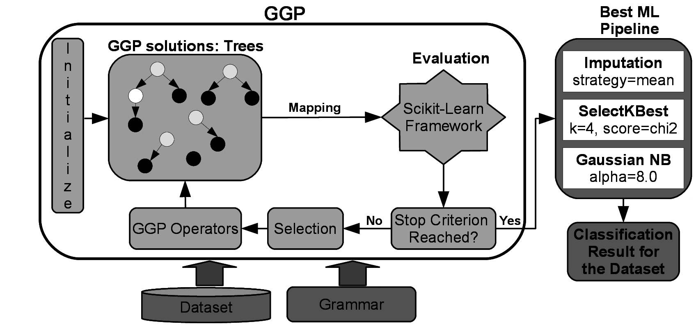
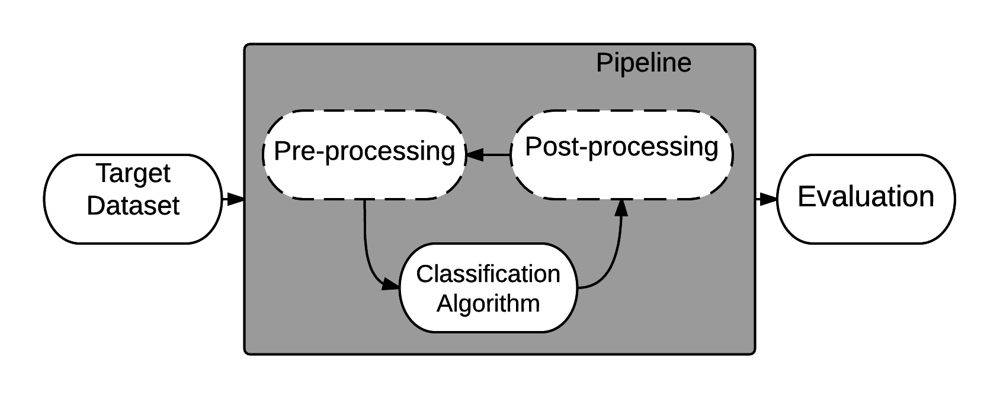
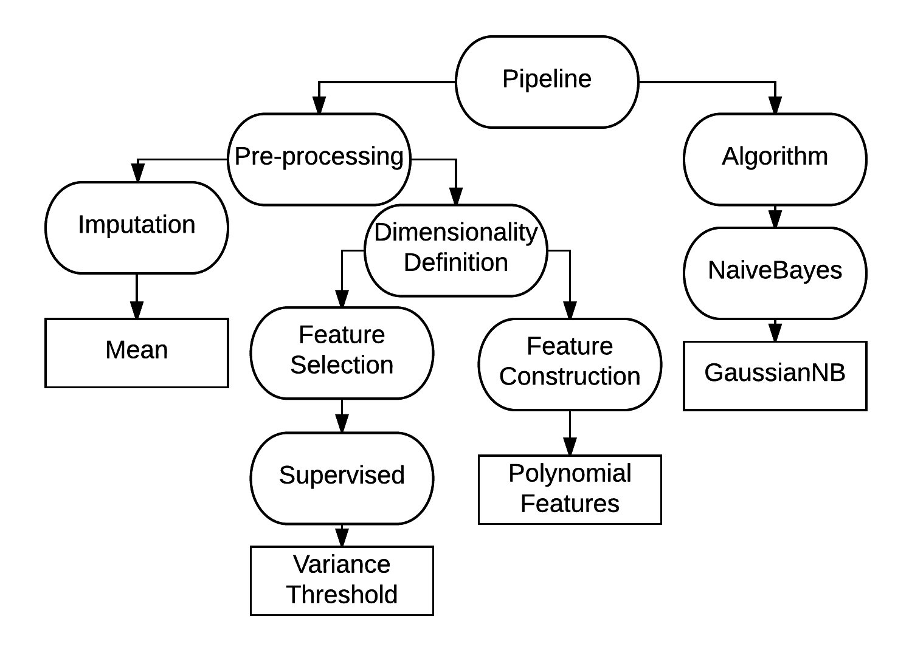

 <h1> RECIPE </h1> 

 <h6>  REsilient ClassifIcation Pipeline Evolution </h6>

___

## How it works?

RECIPE receives as input a dataset and a grammar, which is used to initialize the population. Each individual is represented by a derivation-tree built from the context-free grammar (CFG), which encompasses all the knowledge gathered from specialists on how to generate an effective classification pipeline. The individuals are mapped into pipelines implemented by the SciKit-Learn library, which are executed into a data sample from the application being solved and evaluated according to a metric of accuracy. Crossover and mutation operators are applied after a tournament selection, and guarantee that the new individuals generated also respect the production rules of the grammar. Elitism is also used, and evolution goes on until a maximum number of generations is reached or the best individual does not improve after a predefined number of generations. 

RECIPE was implemented using the library Libgges.

## Grammar

In RECIPE, the grammar represents a set of pipelines that can be used to solve a classification problem. Previously proposed systems have divided the pipelines into three main steps: data pre-processing, data processing and data post-process. We also follow this basic framework.

There is a lot of options of tasks or building blocks that can be considered in this three-step approach, as the area of machine learning is in constant development.

In RECIPE the total number of building blocks are:

Building Blocks| Quantity
------------ | ------------- 
Pre-Processing | 33
Processing | 23

## Individual Representation

Individuals represent machine learning pipelines focused on the classification task. These individuals are generated from the grammar using a set of derivation steps.

